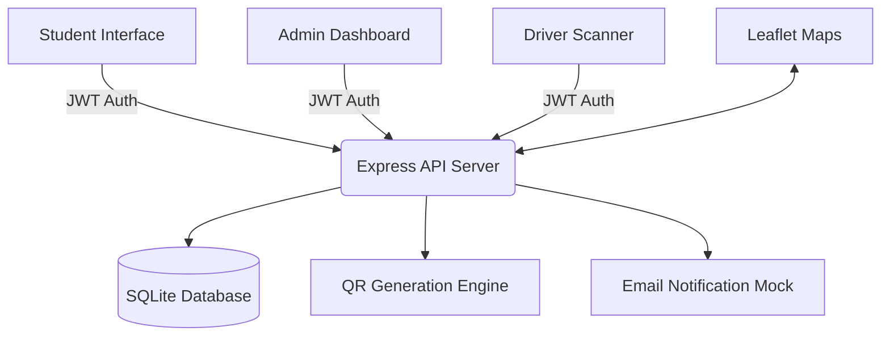

# 🚌 QRide – Smart Campus Bus Pass Management System

[](https://github.com/Adhithiya14/E-Bus-Pass-System-SREC-)
[](https://opensource.org/licenses/MIT)
[](https://reactjs.org/)

**QRide** is a comprehensive, web-based digital solution designed for **Sri Ramakrishna Engineering College (SREC)** to streamline and secure campus transportation. It replaces traditional paper-based bus passes with a sophisticated QR-code validation system, offering real-time verification, automated route management, and seamless fee tracking.

---

## 🚀 Vision & Objectives

QRide aims to transform the campus commute experience by introducing transparency, efficiency, and security into the bus pass lifecycle.

*   **Zero Paperwork**: Move away from manual pass issuance and physical logbooks.
*   **Security First**: Prevent pass misuse through unique, encrypted QR tokens.
*   **Real-Time Efficiency**: Enable instant on-bus verification for checkers.
*   **Data-Driven**: Provide administrators with precise reporting on fee collection and route occupancy.

---

## ✨ Key Features

### 🎓 Student Module
*   **Digital Identity**: Profile registration with photo integration.
*   **Smart Pass**: Access a unique digital pass with dynamic QR codes.
*   **Flexible Travel**: Support for Regular Passes, Pay-per-ride Tickets, and Hosteller Lite passes.
*   **Emergency Pass**: Quick generation of one-day travel permits.
*   **Real-time Maps**: View interactive bus routes and stop timings.
*   **Notifications**: Get alerted when your pass is nearing expiry.

### 🛡️ Admin Module
*   **Approval Workflow**: Review and approve/reject applications with automated email alerts.
*   **Route Management**: Add, update, or remove bus routes and stop coordinates.
*   **Fleet Oversight**: Manage buses and assign drivers to specific routes.
*   **Analytics & Reports**: Generate professional PDF reports for fee defaulters and expired passes.
*   **Security Center**: Monitor system access and manage student data.

### 🚍 Driver & Checker Module
*   **Instant Scanning**: Mobile-responsive scanner to verify student passes in seconds.
*   **Route Tracking**: View assigned stop sequences and scheduled timings.
*   **Security Alerts**: Immediate feedback on expired, invalid, or wrong-route passes.

---

## 🛠️ Technology Stack

| Layer | Technologies |
| :--- | :--- |
| **Frontend** | React 19, Vite, Lucide React (Icons), Framer Motion (Animations), AOS (Scroll Effects) |
| **Mapping** | Leaflet.js, React-Leaflet |
| **Backend** | Node.js, Express.js, JWT (Auth), Bcrypt (Security) |
| **Database** | SQLite (Self-contained, lightweight) |
| **Utilities** | HTML2Canvas (PDFs), QRCode (Generation), HTML5-QRCode (Scanning) |

---

## 📐 System Architecture



---

## 📦 Getting Started

### Prerequisites

*   **Node.js**: v16.x or higher
*   **npm**: v8.x or higher

### Installation

1.  **Clone the Repository**
    ```bash
    git clone https://github.com/Adhithiya14/E-Bus-Pass-System-SREC-.git
    cd E-Bus-Pass-System-SREC-
    ```

2.  **Install Dependencies**
    ```bash
    npm install
    ```

### Running the Application

QRide requires both the backend server and the frontend development server to be running simultaneously.

1.  **Start the Backend (Terminal 1)**
    ```bash
    npm run server
    ```
    *The server will start on `http://localhost:5000`*

2.  **Start the Frontend (Terminal 2)**
    ```bash
    npm run dev
    ```
    *The app will be available at `http://localhost:5173`*

---

## 📂 Project Structure

```text
QRide/
├── server/
│   ├── index.cjs            # Main API Logic & Routes
│   ├── database.cjs         # DB Schema & Seeding
│   ├── route_stops.cjs      # Map Coordinate Data
│   └── qride.db             # Local SQLite Database
├── src/
│   ├── components/          # React Dashboards & UI Components
│   ├── utils/               # API & Helper Functions
│   ├── App.jsx              # Main Router
│   └── main.jsx             # App Entry Point
├── public/                  # Static Assets & Images
└── README.md                # Project Documentation
```

---

## 🛤️ Future Roadmap

- [ ] **Live GPS Tracking**: Real-time bus location updates on the student map.
- [ ] **Payment Gateway**: Integration with Razorpay for automated fee collection.
- [ ] **Mobile App**: Dedicated Android/iOS application for checkers.
- [ ] **Cloud Migration**: Deploying the SQLite DB to a cloud provider for global access.

---

## 👨‍💻 Developed For

**Sri Ramakrishna Engineering College (SREC)**
*Smart Campus Transportation Management Initiative*

---

## 📄 License

This project is licensed under the MIT License - see the [LICENSE](LICENSE) file for details.

---

© 2026 QRide Team | Efficiency in Every Mile.
